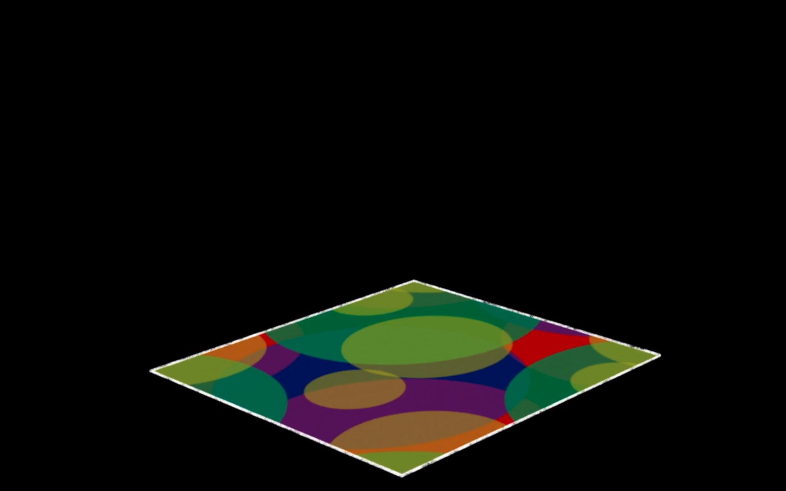
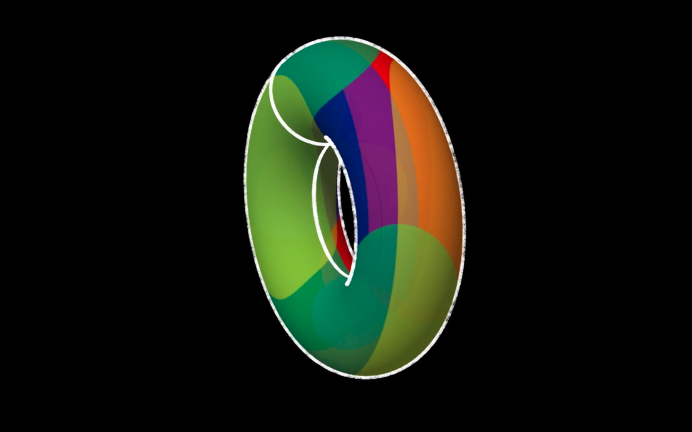
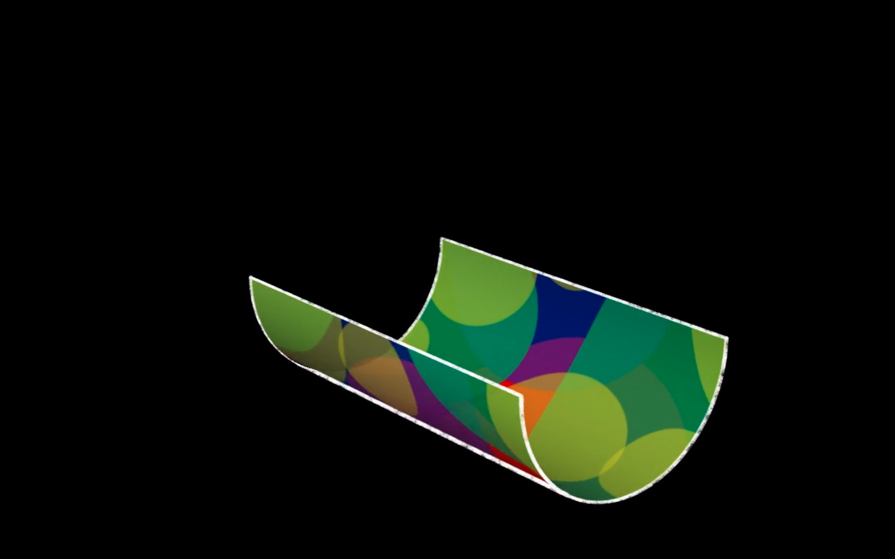
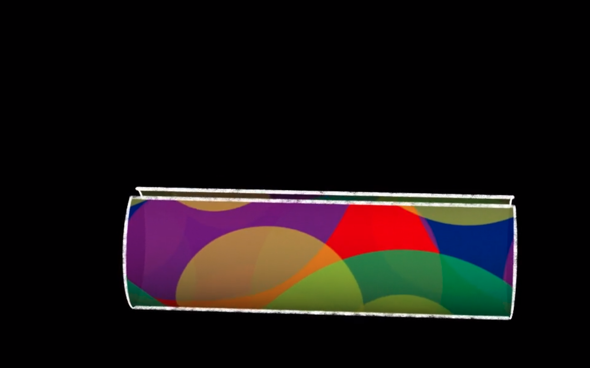
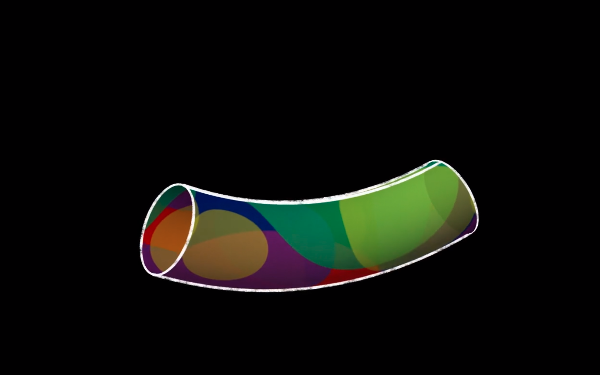
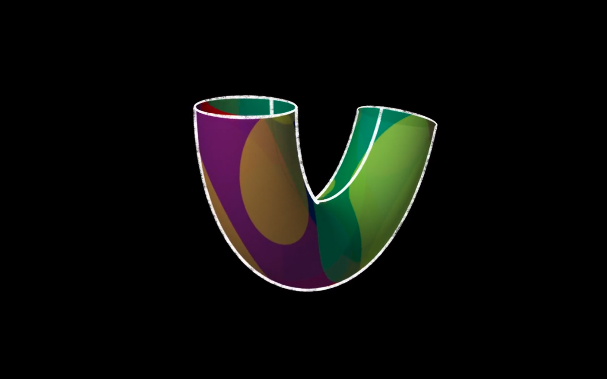
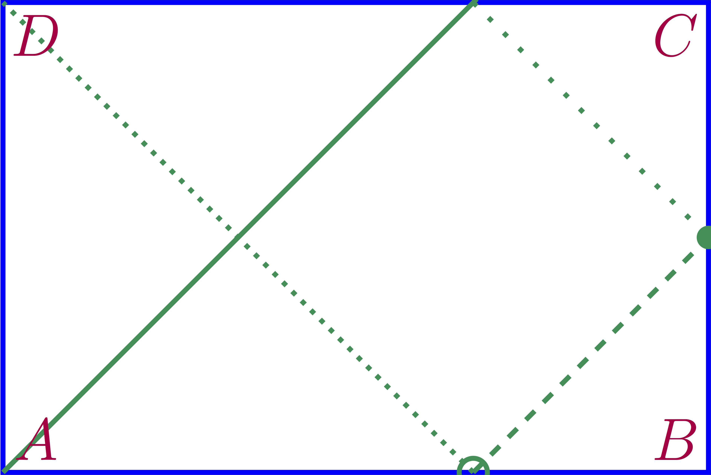
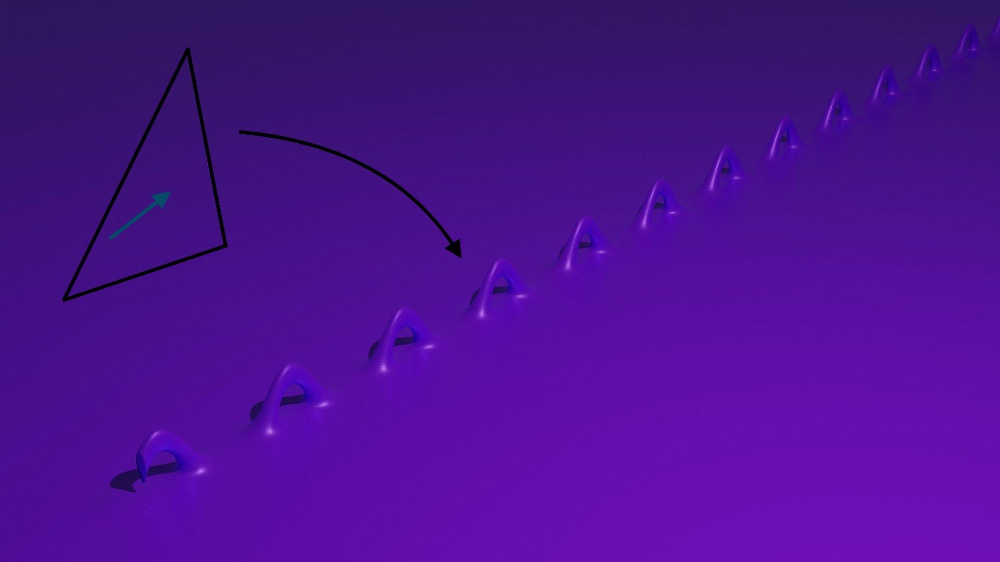
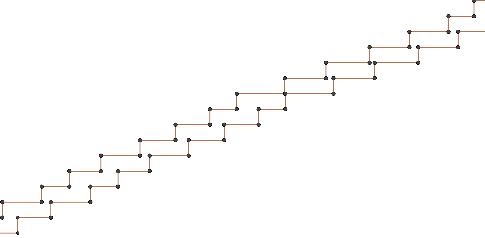
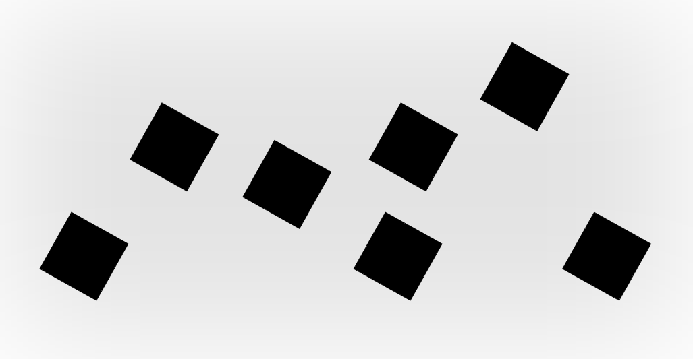

% Alba Marina Málaga Sabogal
% Candidature au poste de maître de conférences n°4730
% {height=18%} ${}$ ${}$ {height=18%}

# Parcours

**E**nseignement, **R**echerche, **D**éveloppement, **M**édiation

|         |               |           |   |   |   |   |
|:--------|:--------------|:----------|:-:|:-:|:-:|:-:|
|2019-2020|ICERM, Brown U.|post-doc    |     |**R**|     |     |
|2017-2019|Inria          |ing. R&    |     |**R**|**D**|     |
|2016-2017|U Paris 8      |ATER       |**E**|**R**|     |     |
|2016     |BlueRidge      |dev        |     |     |**D**|     |
|2015-2016|U Paris-Sud    |ATER       |**E**|**R**|     |     |
|2015     |Aix-Marseille U|post-doc   |     |**R**|     |     |
|2015     |IMAGINARY      |coord. FR  |     |     |     |**M**|
|2011-2014|U Paris-Sud    |doctorat   |**E**|**R**|**D**|**M**|
|2009-2011|U Paris-Sud    |master     |     |     |     |     |
|2008-2011|Polytechnique  |cycle ingé.|     |     |     |     |
|2008     |UNI (Lima)     |chargée TD |**E**|     |     |     |
|2004-2006|IMCA (Lima)    |master     |     |     |     |     |
|2002-2006|UNI (Lima)     |licence    |     |     |     |     |

# Recherche

Dynamique et théorie ergodique sur des surfaces de translation de mesure infinie 

## Surfaces de translation

Le tore: exemple élementaire de surface de translation

{.center #fig:toreplat height=450px}

----------------------------------

{.center #fig:torerond height=450px}

----------------------------------

En fait, c'est le même espace topologique:

{.center #fig:tore1 height=450px}

----------------------------------

En fait, c'est le même espace topologique:

{.center #fig:tore2 height=450px}

----------------------------------

En fait, c'est le même espace topologique:

{.center #fig:tore3 height=450px}

----------------------------------

En fait, c'est le même espace topologique:

{.center #fig:tore4 height=450px}

----------------------------------

En fait, c'est le même espace topologique:

{.center #fig:tore5 height=450px}

----------------------------------

En fait, c'est le même espace topologique:

{.center #fig:tore6 height=450px}

----------------------------------

Le point de départ: les billards mathématiques.

{.center #fig:billard height=450px}

----------------------------------

Les billards mathématiques se déplient en surfaces de translation.

{.center #fig:unfold height=450px}}

-------------------------------------------------------------------------------------

## Exemples de surfaces de translation de genre infini

Dépliages de billards irrationnels

{.center #fig:billiard-loch-ness height=450px}

--------------------------------------------------

Surfaces en escalier

{.center #fig:escalier height=450px}

----------------------------------

Le wind-tree et son dépliage

{.center #fig:escalier height=450px}

## Résultats

Generiquement, le flot par droites dans de larges classes de surfaces de translation de genre infini (wind-trees, escaliers, $\dots$ ) est:

- conservatif
- minimal
- ergodique
- uniquement ergodique

# Enseignements

## Expérience d'enseignement

**>600h** dont 192h responsable de cours

|         |                  |    |    |  
|:--------|:-----------------|:---|:---|
|2018-2019|U Paris-Saclay (60h)|info|{width=7.5%}|
|2016-2017|U Paris 8 (192h)  |info|{width=7.5%}|
|2015-2016|U Paris-Sud (192h)|math|{width=7.5%}|
|2014     |U Paris-Sud (96h) |math|{width=7.5%}|
|2008     |UNI (192h)        |math|{width=7.5%}|

## Cours, cours intégrés, TD

* Équations différentielles
* Mathématiques numériques avec Python
* Calculus
* Analyse
* Calcul formel avec SageMath
* Structures algébriques
* CMS avec Wordpress
* Algèbre linéaire
* Calcul vectoriel
* Calcul intégral
* Programmation orientée objet avec Java
* Introduction à l’informatique

## Facultés d'adaptation

* Programme du lycée très différent du mien
    * j'ai étudié les programmes (EduScol)
* Cours de maths numériques sans ordinateurs
    - Python sur smartphone (console Android)
* Étudiants d'origines diverses
    - je peux enseigner en français, anglais, espagnol, polonais
* ...

## Future adaptation à la FSEG ?

* je connais déjà Python et R
* j'ai déjà fait de l'apprentissage machine
* je pourrai apprendre Stata, SAS
* je m'interesse déjà à l'économie qualitative et quantitative à titre personnel:
    - parmi mes livres préferés il y en a qui sont écrits par Jean Tirolé, Anne Duflo, Joseph  Stiglitz, ...
* apprendre tout au long de la vie, c'est ma devise 
    

# Autres activités

{.center #fig:lorentz height=32mm}
{.center #fig:intimite height=32mm}

----------------------------------

{.center #fig:vieux-port height=36mm}
{.center #fig:objets height=36mm}

----------------------------------

{.center #fig:miroir width=100%}

----------------------------------

{.center #fig:autruche height=450px}

----------------------------------

{.center #fig:autruches height=450px}

# Merci!

