% Alba Marina Málaga Sabogal
% Candidature au poste de maître de conférences n°4730
% 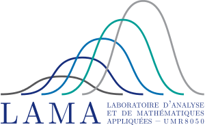{height=18%} ${}$ ${}$ {height=18%}

# Parcours

## **E**nseignement, **R**echerche, **D**éveloppement, **M**édiation

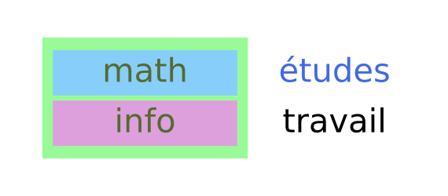{width=25%}
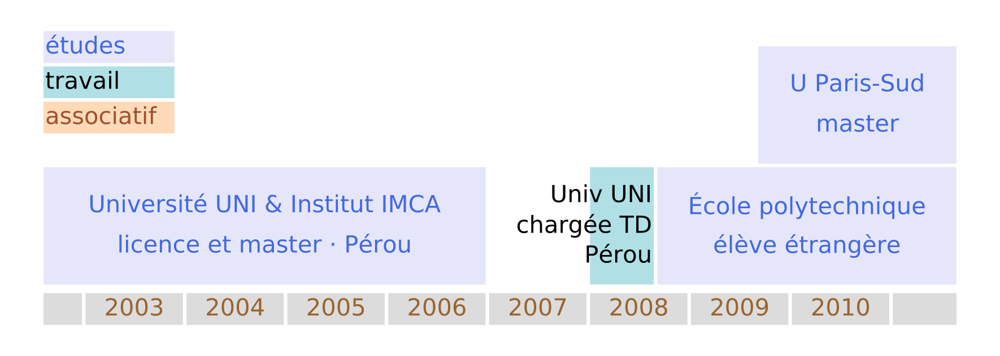{width=90%}
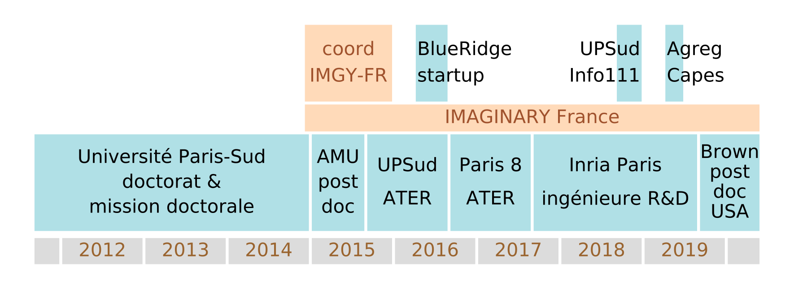{width=90%}

# Recherche

Dynamique et théorie ergodique sur des surfaces de translation de mesure infinie

## Les systèmes dynamiques

- Evolution déterministe à court terme, qu'on connaît.
- On se pose des questions concernant l'évolution à long terme.

## Exemple: les rotations du cercle

\centering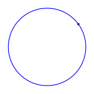{width=50%}\par

----------------------------------------------------------------

\centering{width=60%}\par

----------------------------------------------------------------

\centering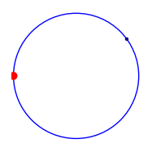{width=60%}\par

----------------------------------------------------------------

\centering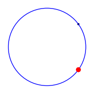{width=60%}\par

----------------------------------------------------------------

\centering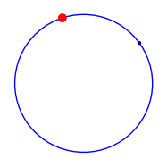{width=60%}\par

----------------------------------------------------------------

\centering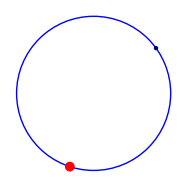{width=60%}\par

----------------------------------------------------------------

\centering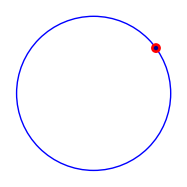{width=60%}\par

---------------------------------------------------------------

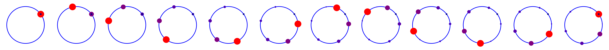{width=100%}

**Thm:** (Poincaré) Une rotation du cercle est périodique si et seulement si elle est rationnelle. Sinon, elle est ergodique.

## Exemple: le flot linéaire sur un tore plat

### Qu'est-ce qu'un tore ?

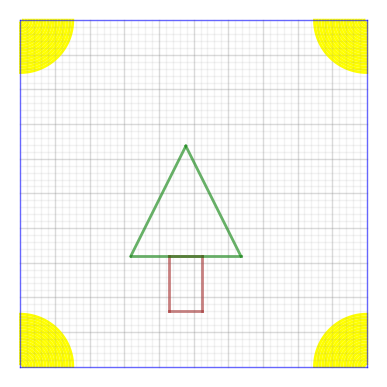{width=35%} ${}$ ${}$ ${}$   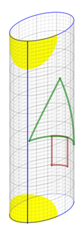{width=15%} ${}$ ${}$ ${}$   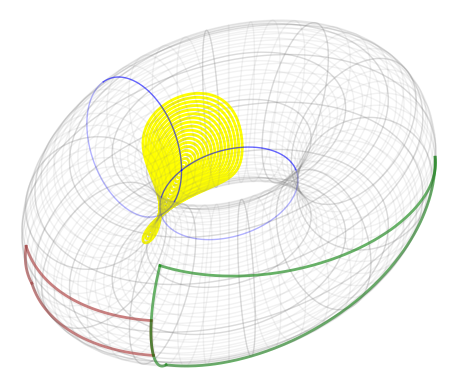{width=40%}

\begin{figure}[!h]
\caption{Dessins pour comprendre le tore plat par Lelièvre et Goujard.}
\end{figure}

-----------------------------------------------------------------------------------

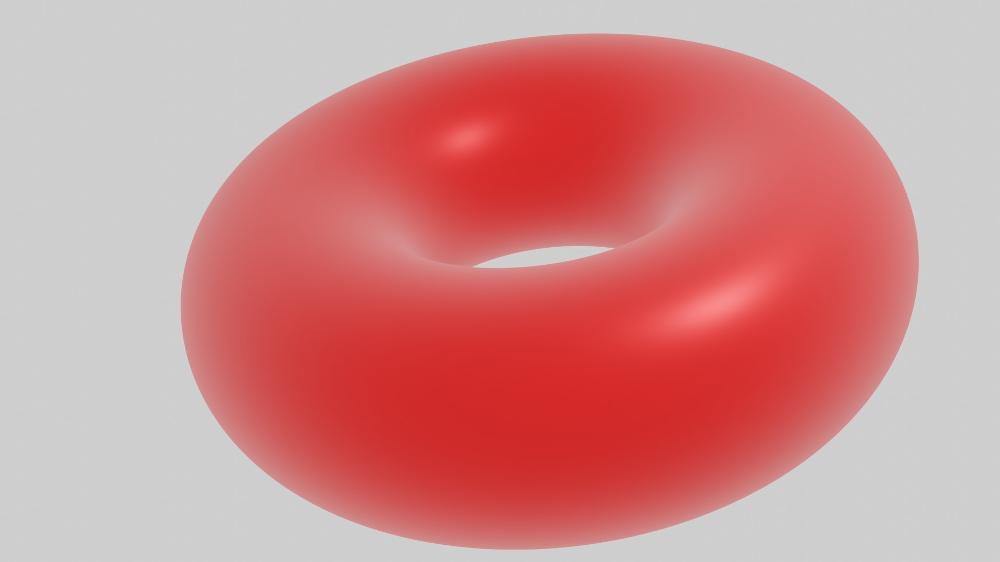{width=30%}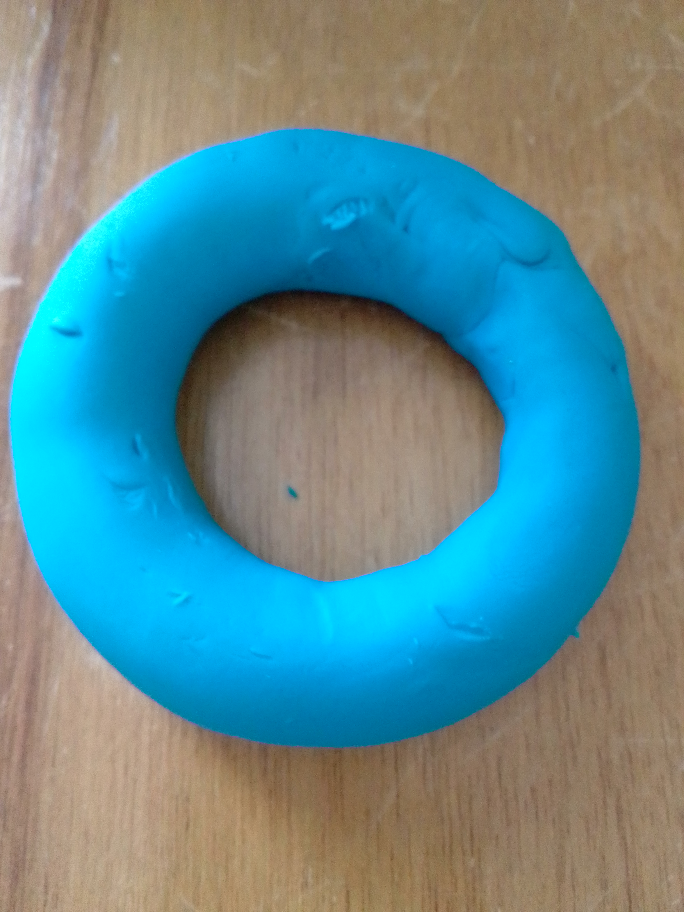{width=30%}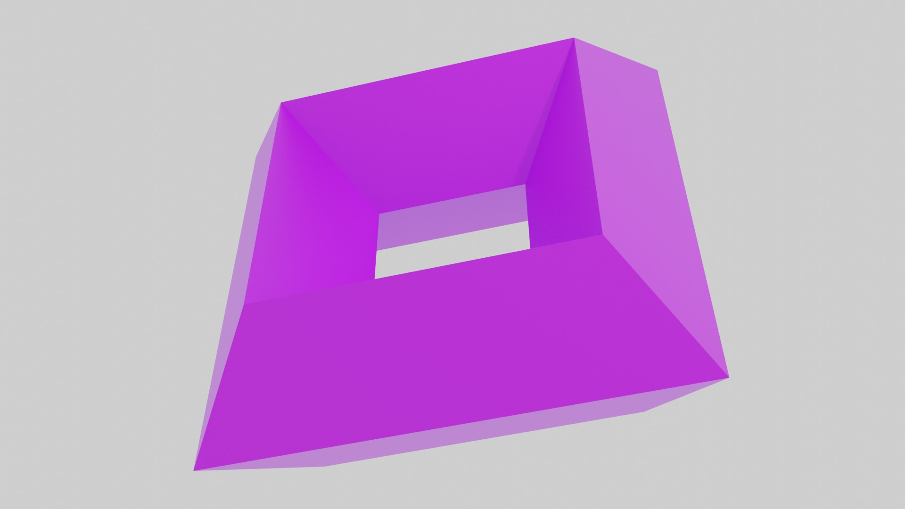{width=30%}
\begin{figure}[!h]
\caption{Tores topologiques.}
\end{figure}

---------------------------------------------------------------------------------

### Comment bouge-t-on sur un tore plat? 

\

, par Primož Žnidar](img/snake-on-a-torus.png){width=60%}

------------------------------------------------------------------------------

### Retour aux rotations du cercle

\

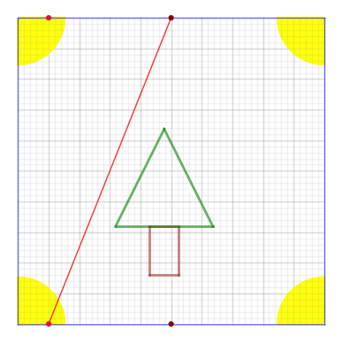{width=35%} ${}$ ${}$ ${}$   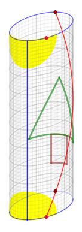{width=15%} ${}$ ${}$ ${}$   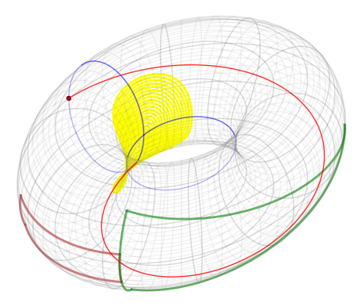{width=40%}

\begin{figure}[!h]
\caption{Trajectoire sur le tore, par Lelièvre et Goujard.}
\end{figure}

## Exemple: les billards

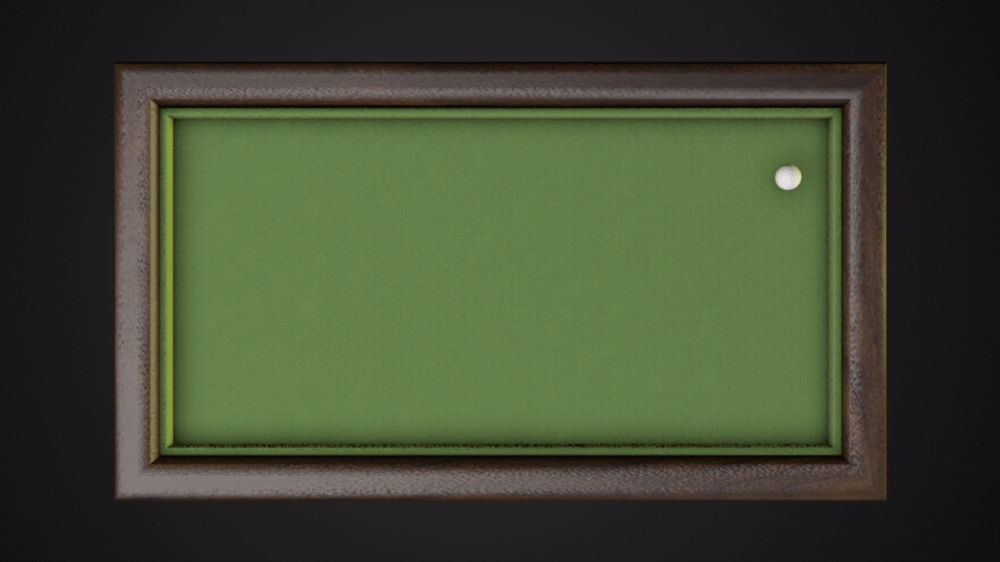{width=100%}

[Extrait](movies/ball-rolling-on-a-billiard-table-hale.mov) du film "Secrets of Surfaces" de Csicsery, comme les autres images et animations de Andrea Hale à suivre.

## Le dépliage des billards

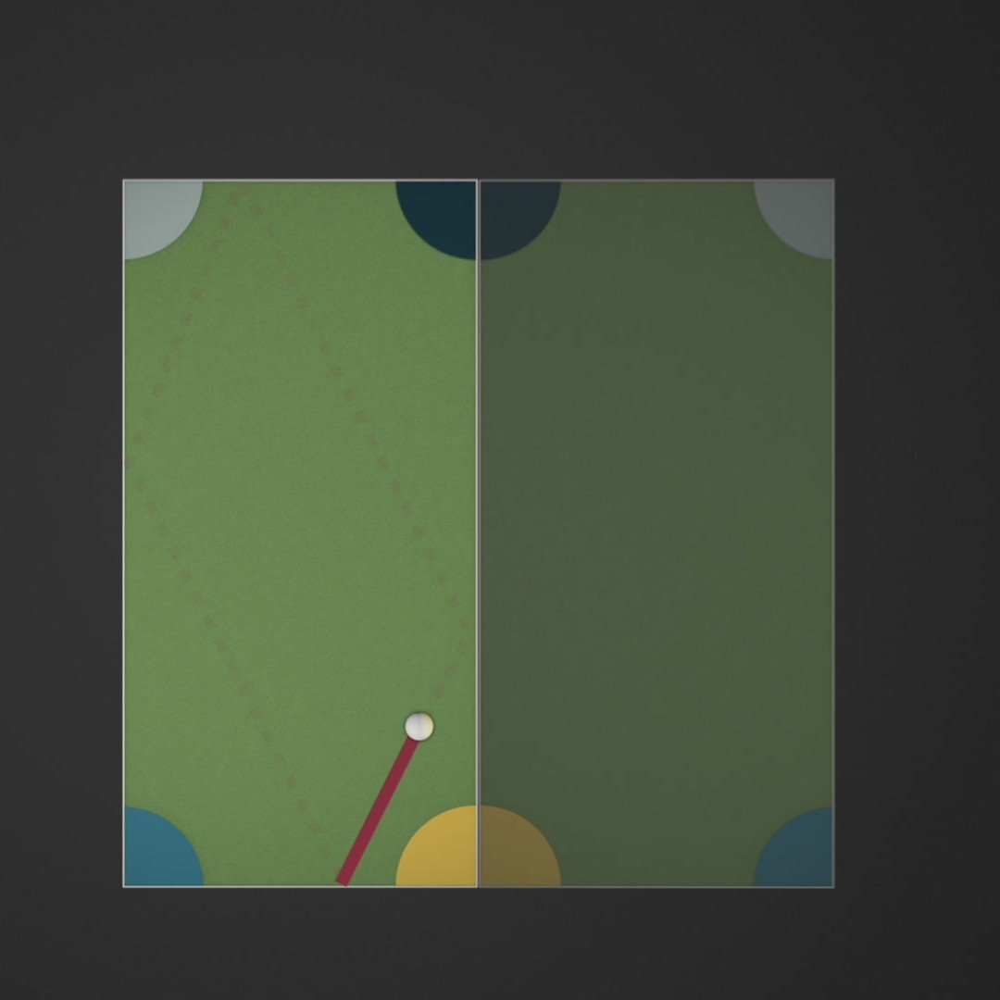{height=42mm}
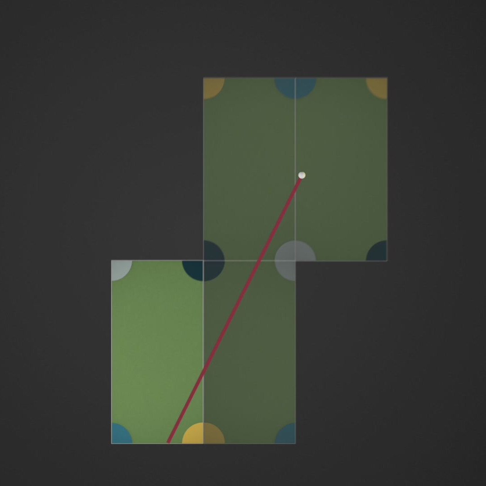{height=42mm}
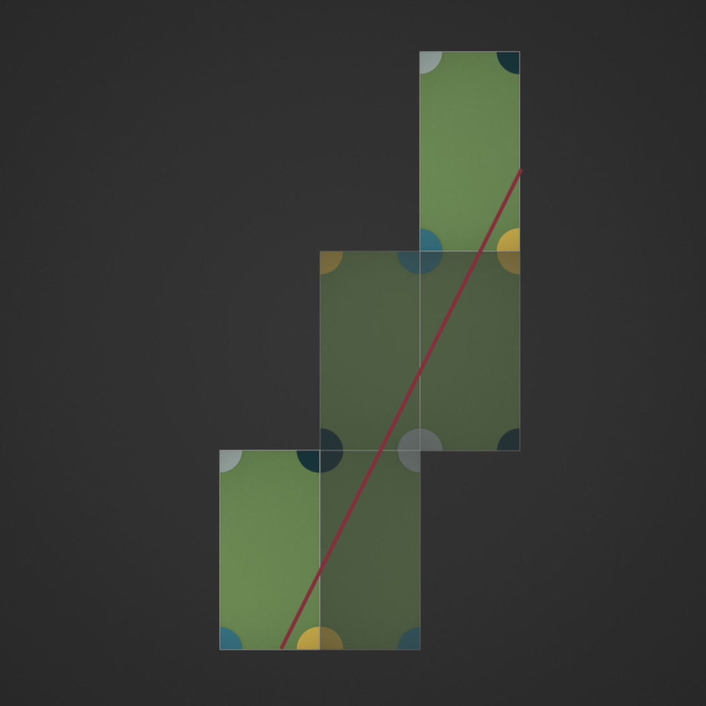{height=42mm}
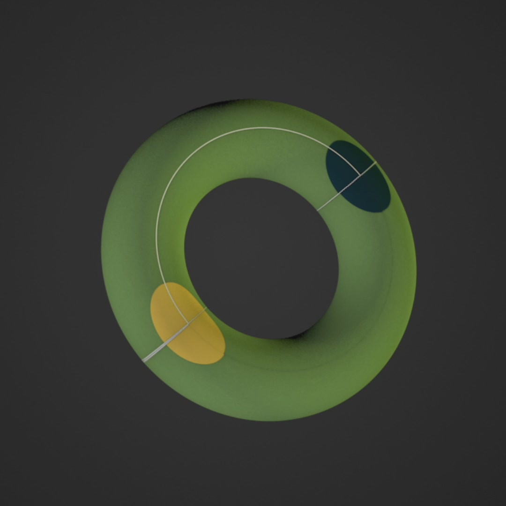{height=42mm}
{width=100%}

## Exemple: la surface en L

, par MS](img/snake-L-1.png){width=60%}

## Surfaces de translation et billards  «infinis»

Le dépliage d'un billard irrationnel est une surface de genre infini.

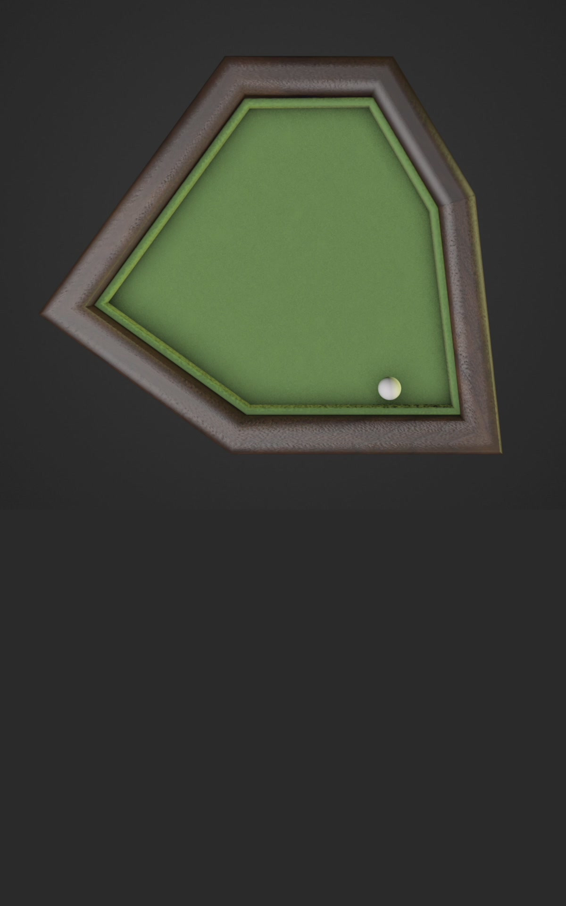{height=44mm}
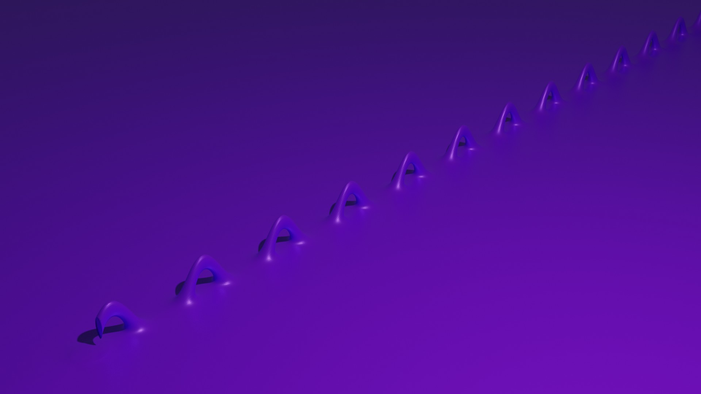{height=44mm}
\begin{figure}[!h]
\caption{Un billard irrationnel par Hale, un monstre du Loch Ness.}
\end{figure}

------------------------------------------------------------------------------------------

{height=450px}

---------------------------------------------------------------------------------------

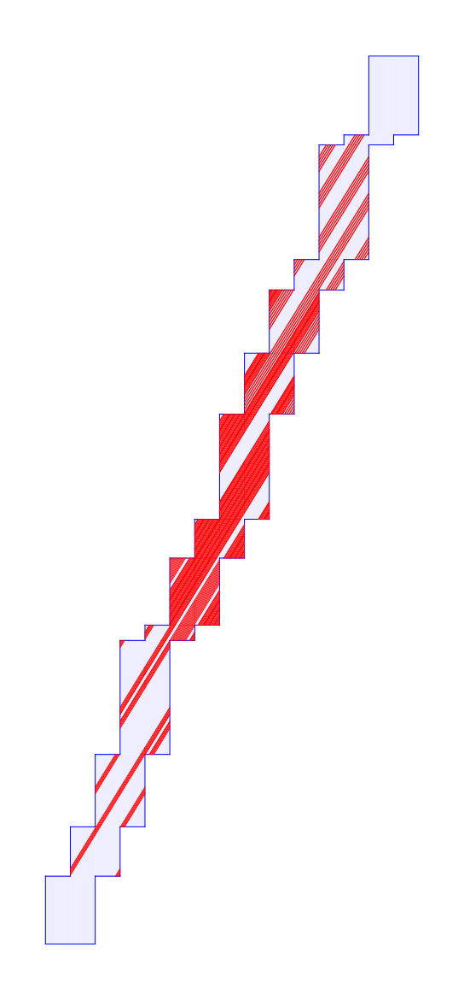{height=320px}

----------------------------------------------------------------------------------------

](img/wind-tree.png){width=50%}

## Résultats

**Thm** (MS, 2014) Si l'on fixe une direction dans le plan alors la dynamique d'un escalier générique dans cette direction est conservative, minimale et ergodique.

**Thm:** (MS \& Troubetzkoy, 2015) Génériquement, la dynamique du wind-tree est minimale dans un large ensemble de directions. 

**Thm:** (MS \& Troubetzkoy, 2016) Génériquement, la dynamique du wind-tree dans presque toute direction est ergodique.

**Thm:** (MS \& Troubetzkoy, 2016) La dynamique d'un billard VH est faiblement mélangeante dans un ensemble large de directions.

**Thm:** (MS \& Troubetzkoy, 2017) Génériquement, la dynamique du wind-tree est d'indice ergodique infini dans un large ensemble de directions.

**Thm:** (MS \& Troubetzkoy, 2019) Génériquement, la dynamique des surfaces en escalier est uniquement ergodique dans un large ensemble de directions.

**Thm:** (MS \& Troubetzkoy, 2019) Génériquement, la dynamique du wind-tree est uniquement ergodique dans un large ensemble de directions.

## Publications

Alba Málaga Sabogal, Serge Troubetzkoy. (2016)  "Minimality of the Ehrenfest wind-tree model" *Journal of modern dynamics*. 10 (209-228)

Alba Málaga Sabogal, Serge Troubetzkoy. (2016)  "Ergodicity of the Ehrenfest wind–tree model." *Comptes Rendus Mathematique*. Volume 354, Issue 10, Pages 1032-1036.

Alba Málaga Sabogal, Serge Troubetzkoy, (2017). "Weakly mixing polygonal billiards." *Bull. London Math. Soc.*. 49 (141-147).

Alba Málaga Sabogal, Serge Troubetzkoy, (2018). "Infinite ergodic index of the Ehrenfest wind-tree model." *Commun. Math. Phys.*. 358 (995–1006).

Alba Málaga Sabogal, Serge Troubetzkoy, (2019). "Unique ergodicity of infinite area translation surfaces." *preprint*

## Les Ehrenfest
{width=40%}
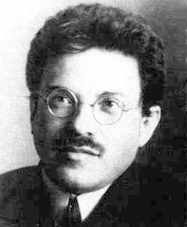{width=40%}
\begin{figure}[!h]
\caption{Paul et Tatiana Ehrenfest}
\end{figure}

## Application  à la conjecture des Ehrenfest (1912)

{width=80%}

**Corollaire** (de MS \& Troubetzkoy, 2018) La conjecture des Ehrenfest est satisfaite par un wind-tree générique lorsque la fréquence des directions est calculée sur un domaine de mesure finie (mais arbitrairement grande).

# Enseignements

## Expérience d'enseignement 

|         |Lieu d'exercice|    |quelques cours|  
|----:|:------------|:------|:--------------------|
|2018-2019|U Paris-Saclay (60h)|info|{width=7.5%}|
|2016-2017|U Paris 8 (192h)  |info|{width=7.5%}|
|                 |                              |L2 MIASHS| Math. numériques|
|2015-2016|U Paris-Sud (192h)|math|{width=7.5%}|
|                 |                               |L3 BS, C| Équa. diff.|
|                 |                               |L1 MPI | Algèbre linéaire|
|                 |                               |PCSO| Géométrie, Analyse|
|2014     |U Paris-Sud (96h) |math|{width=7.5%}|
|                 |                               |L2 BC | Équa. diff.|
|2008     |UNI (192h)        |math|{width=7.5%}|
|                 |                               |L2 M | Algèbre linéaire|
|                 |                               |L1 MPC | Calcul vectoriel|

**>600h** dont 192h responsable de cours

## Cours, cours intégrés, TD

* Équations différentielles
* Mathématiques numériques avec Python
* Calculus
* Analyse
* Calcul formel avec SageMath
* Structures algébriques
* CMS avec Wordpress
* Algèbre linéaire
* Calcul vectoriel
* Calcul intégral
* Programmation orientée objet avec Java
* Introduction à l’informatique

## Facultés d'adaptation

* Programme du lycée très différent du mien
    * j'ai étudié les programmes (EduScol)
* Cours de maths numériques sans ordinateurs
    - Python sur smartphone (console Android)
* Étudiants d'origines diverses
    - je peux enseigner en français, anglais, espagnol, polonais
* ...

## Les cours de mathématiques à la FSEG

En licence: bases mathématiques de la modélisation économique et de la gestion.

|Année   |Intitulé du cours                               |
|--------|------------------------------------------------|
|Parcours Amenagé|Mathématiques                           |
|                |Statistiques descriptives I             |
|L1              |Mathématiques                           |
|                |Statistiques et outils informatiques I  |
|Passerelle      |Outils mathématiques                    |
|                |Statistiques  descriptives  sur  Excel  |
|L2              |Mathématiques                           |
|                |Probabilités, estimation et tests       |
|L3              |Mathématiques des Systèmes Dynamiques   |
|                |Processus stochastiques en finance      |
|                |Optimisation dynamique                  |

Cours spécialisés en master: science des données, apprentissage automatique

## Future adaptation à la FSEG ?

* je connais déjà Python et R
* j'ai déjà enseigné les équations différentielles à des étudiants de parcours divers
* j'ai déjà fait de l'apprentissage machine
* je pourrai apprendre Stata, SAS
* je m'interesse déjà à l'économie qualitative et quantitative à titre personnel:
    - parmi mes livres préferés il y en a qui sont écrits par Jean Tirolé, Anne Duflo, Joseph  Stiglitz, ...
* apprendre tout au long de la vie, c'est ma devise 
* idées de projets avec des étudiants en économie
    
    - "Les grands perdants du Covid-19: les exodes urbains-ruraux en 2020"
    - "Les poinçonneuses numériques: quel impact ont les outils modernes de suivi du temps sur le revenu des travailleurs indépendants ?"
    - "Fiabilité des recensement sde population universel versus les recensements randomisés"
    - "Les résultats Pisa et les politiques éducatives dans les pays de l'OCDE"
    - "Le transport public: pourquoi la mise en place de navettes/bus/trains gratuits n'éliminera pas l'usage de la voiture"

# Autres activités

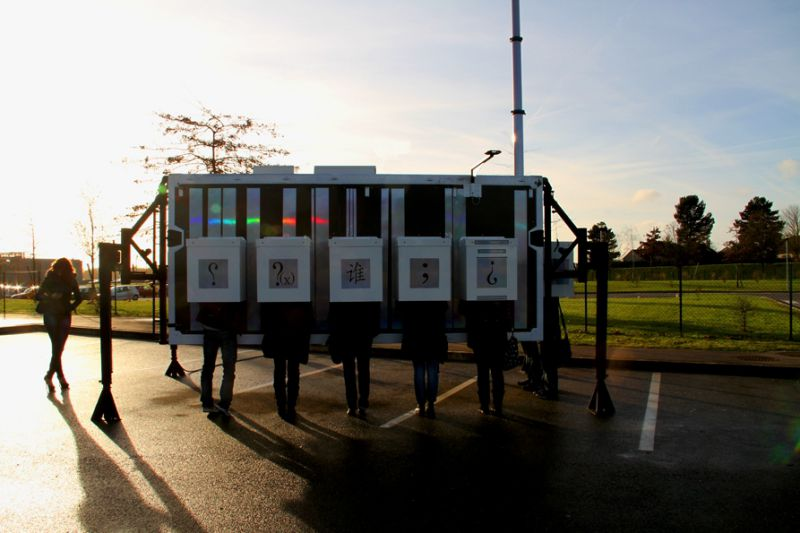{.center #fig:lorentz height=32mm}
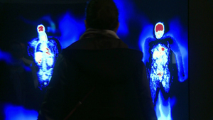{.center #fig:intimite height=32mm}
{.center #fig:vieux-port height=36mm}
{.center #fig:objets height=36mm}

**Médiation scientifique:** ~ 30 expositions, forums, salons, exposés 

# Conclusion

## Pour finir...

|                                                   |                                                |                                                        |
|-------------------------------------------|----------------------------------------|-----------------------------------------|
|parcours polyvalent          |un vrai souci de l'accessibilité  |fibre "maker"|
|intérêt en médiation scientifique|enseignement dans le respect|continuité dans la recherche|

J'aimerais beaucoup travailler avec vous.

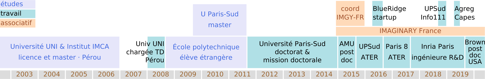{width=100%}

