% Alba Marina Málaga Sabogal
% Audition pour le poste de maître de conférences n°4730
% 25 mai 2020

# Parcours

## Études et vie professionnelle

{width=90%}

{width=90%}

# Recherche

## Mes mentors au fil du temps

En projet et stage de 2e et 3e années à l'École polytechnique,\
en M2 puis en thèse à Orsay, puis en postdoc à Marseille\
et à Providence aux États-Unis, j'ai été encadrée par:

----------  -----------------------------   ----------------------
2010--2011  Projet scientifique collectif   Gilles Courtois
2011        Stage de recherche              Vadim Lyubashevsky
2011        Stage de recherche M2           Sylvie Ruette
2011--2014  Thèse doctorale                 Jean-Christophe Yoccoz
2015        Post-doctorat                   Alexander Bufetov
2019--2020  Post-doctorat                   Richard Schwartz
----------  -----------------------------   ----------------------

Depuis 2015 j'ai une collaboration suivie avec Serge Troubetzkoy sur la dynamique de surfaces de translation de mesure infinie. 

## Les systèmes dynamiques

- Évolution déterministe à court terme, connue
- Questions concernant l'évolution à long terme

### Exemple: les rotations du cercle

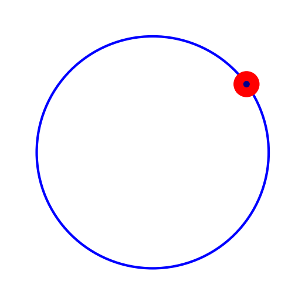{width=60%}

## Les systèmes dynamiques

- Évolution déterministe à court terme, connue
- Questions concernant l'évolution à long terme

### Exemple: les rotations du cercle

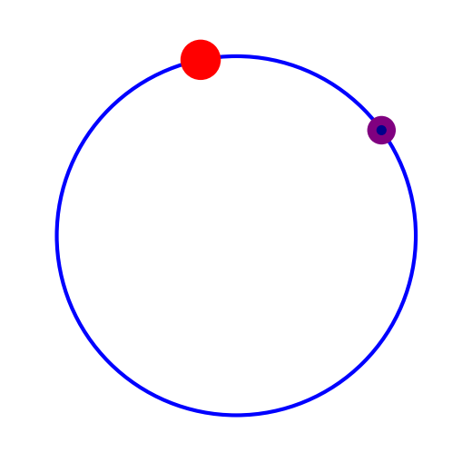{width=60%}

## Les systèmes dynamiques

- Évolution déterministe à court terme, connue
- Questions concernant l'évolution à long terme

### Exemple: les rotations du cercle

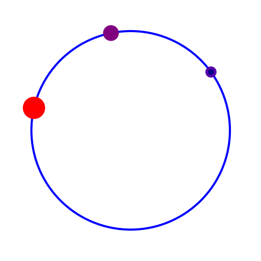{width=60%}

## Les systèmes dynamiques

- Évolution déterministe à court terme, connue
- Questions concernant l'évolution à long terme

### Exemple: les rotations du cercle

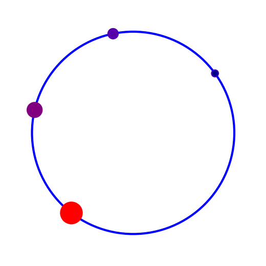{width=60%}

## Les systèmes dynamiques

- Évolution déterministe à court terme, connue
- Questions concernant l'évolution à long terme

### Exemple: les rotations du cercle

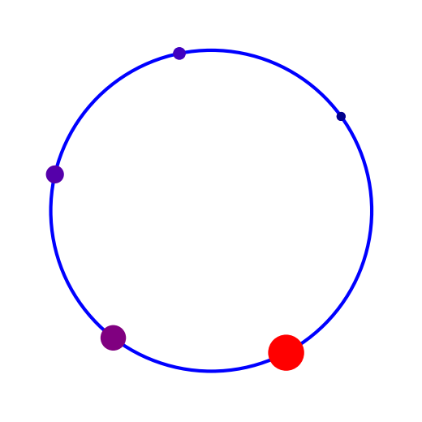{width=60%}

## Les systèmes dynamiques

- Évolution déterministe à court terme, connue
- Questions concernant l'évolution à long terme

### Exemple: les rotations du cercle

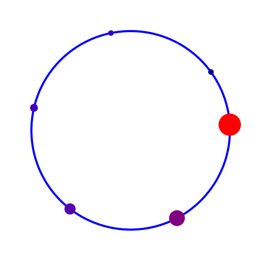{width=60%}

## Les systèmes dynamiques

- Évolution déterministe à court terme, connue
- Questions concernant l'évolution à long terme

### Exemple: les rotations du cercle

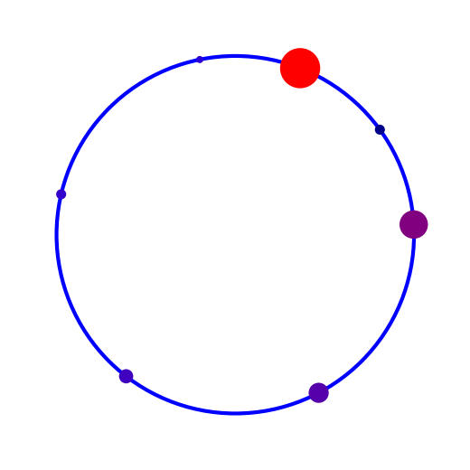{width=60%}

## Les systèmes dynamiques

- Évolution déterministe à court terme, connue
- Questions concernant l'évolution à long terme

### Exemple: les rotations du cercle

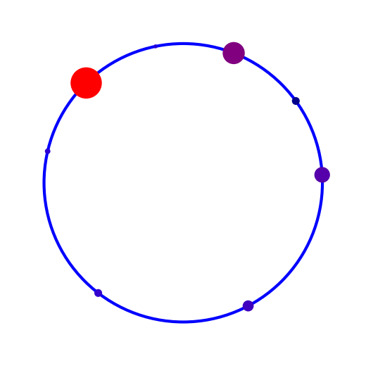{width=60%}

## Les systèmes dynamiques

- Évolution déterministe à court terme, connue
- Questions concernant l'évolution à long terme

### Exemple: les rotations du cercle

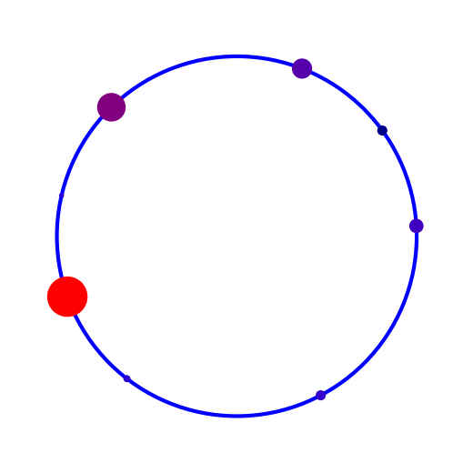{width=60%}

## Les systèmes dynamiques

- Évolution déterministe à court terme, connue
- Questions concernant l'évolution à long terme

### Exemple: les rotations du cercle

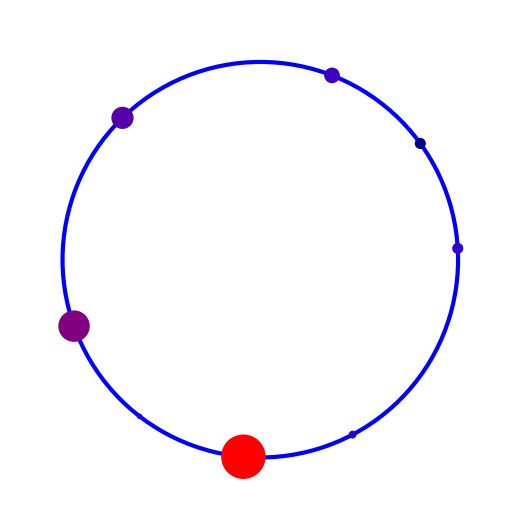{width=60%}

## Les systèmes dynamiques

- Évolution déterministe à court terme, connue
- Questions concernant l'évolution à long terme

### Exemple: les rotations du cercle

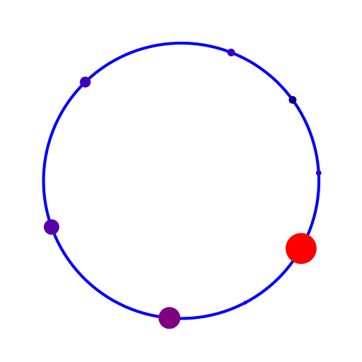{width=60%}

## Les systèmes dynamiques

- Évolution déterministe à court terme, connue
- Questions concernant l'évolution à long terme

### Exemple: les rotations du cercle

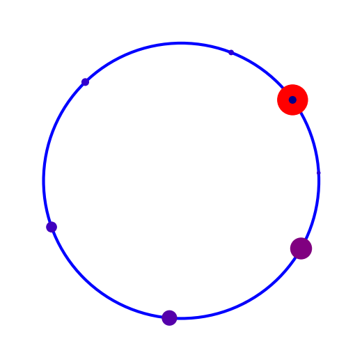{width=60%}

## Les systèmes dynamiques

- Évolution déterministe à court terme, connue
- Questions concernant l'évolution à long terme

### Exemple: les rotations du cercle

{width=60%}

## Les systèmes dynamiques

- Évolution déterministe à court terme, connue
- Questions concernant l'évolution à long terme

### Exemple: les rotations du cercle

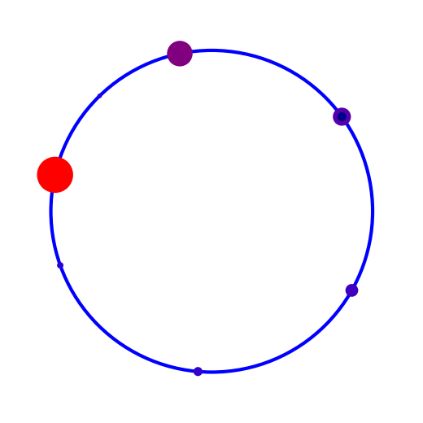{width=60%}

## Les systèmes dynamiques

- Évolution déterministe à court terme, connue
- Questions concernant l'évolution à long terme

### Exemple: les rotations du cercle

{width=60%}

## Les systèmes dynamiques

- Évolution déterministe à court terme, connue
- Questions concernant l'évolution à long terme

### Exemple: les rotations du cercle

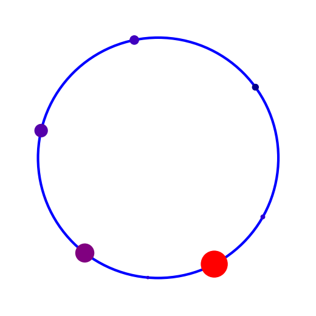{width=60%}

## Les systèmes dynamiques

- Évolution déterministe à court terme, connue
- Questions concernant l'évolution à long terme

### Exemple: les rotations du cercle

Vue de plusieurs itérations.

{width=100%}

\vspace{30mm}

**Thm** (Poincaré) Une rotation du cercle est périodique si et seulement si elle est rationnelle. Sinon, elle est ergodique.

## Exemple: le flot linéaire sur un tore plat

### Qu'est-ce qu'un tore?

{width=35%} ${}$ ${}$ ${}$   {width=15%} ${}$ ${}$ ${}$   {width=40%}

\begin{figure}[!h]
\caption{Dessins pour comprendre le tore plat par Lelièvre et Goujard.}
\end{figure}

-----------------------------------------------------------------------------------

### Quelques exemples de tores

{width=30%}{width=30%}{width=30%}
\begin{figure}[!h]
\caption{Tores topologiques.}
\end{figure}

---------------------------------------------------------------------------------

### Comment se déplace-t-on sur un tore plat?

\vfill

, par Primož Žnidar](img/snake-on-a-torus.png){width=60%}

------------------------------------------------------------------------------

### Retour aux rotations du cercle

\vfill

{width=35%} ${}$ ${}$ ${}$   {width=15%} ${}$ ${}$ ${}$   {width=40%}

\begin{figure}[!h]
\caption{Trajectoire sur le tore, par Lelièvre et Goujard.}
\end{figure}

## Exemple: les billards

{width=100%}

[Extrait](movies/ball-rolling-on-a-billiard-table-hale.mov) du film «Secrets of the Surface» de Csicsery, comme les autres images et animations de Andrea Hale à suivre.

## Le dépliage des billards

{height=42mm}
{height=42mm}
{height=42mm}
{height=42mm}

{width=100%}

## Exemple: la surface en L

, par MS](img/snake-L-1.png){width=60%}

## Surfaces de translation et billards «infinis»

Le dépliage d'un billard irrationnel est une surface de genre infini.

{height=44mm}
{height=44mm}
\begin{figure}[!h]
\caption{Billard irrationnel par Hale, monstre du Loch Ness par MS.}
\end{figure}

## Surfaces de translation et billards «infinis»

{height=450px}

## Surfaces de translation et billards «infinis»

{height=280px}

## Surfaces de translation et billards «infinis»

](img/wind-tree.png){width=60%}

## Ma thèse sous la direction de J.-C. Yoccoz

J'ai soutenu en 2014 à Orsay une thèse de doctorat intitulée

*Étude d'une famille de transformations\
préservant la mesure de $ℤ × 𝕋$.*

sous la direction de Jean-Christophe Yoccoz (Collège de France).

Mes résultats sur $ℤ × 𝕋$ peuvent s'exprimer en termes de dynamique des escaliers infinis.

**Thm** (2014) Si l'on fixe une direction dans le plan alors la dynamique d'un escalier générique dans cette direction est conservative, minimale et ergodique.

## Mes travaux avec Serge Troubetzkoy

Nous poussons beaucoup plus loin les thèmes de ma thèse.

**Thm** (2015) Génériquement, la dynamique du wind-tree est minimale dans un large ensemble de directions.

**Thm** (2016) Génériquement, la dynamique du wind-tree dans presque toute direction est ergodique.

**Thm** (2016) La dynamique d'un billard VH est faiblement mélangeante dans un large ensemble de directions.

**Thm** (2017) Génériquement, la dynamique du wind-tree est d'indice ergodique infini dans un large ensemble de directions.

**Thm** (2019) Génériquement, la dynamique des surfaces en escalier est uniquement ergodique dans un large ensemble de directions.

**Thm** (2019) Génériquement, la dynamique du wind-tree est uniquement ergodique dans un large ensemble de directions.

## Publications — disponibles sur HAL

Alba Málaga Sabogal, Serge Troubetzkoy (2016)\
Minimality of the Ehrenfest wind-tree model\
*Journal of modern dynamics* 10 (209–228)

Alba Málaga Sabogal, Serge Troubetzkoy (2016)\
Ergodicity of the Ehrenfest wind–tree model\
*Comptes rendus mathématique* 354:10 (1032–1036)

Alba Málaga Sabogal, Serge Troubetzkoy (2017)\
Weakly mixing polygonal billiards\
*Bull. London Math. Soc.* 49 (141–147)

Alba Málaga Sabogal, Serge Troubetzkoy (2018)\
Infinite ergodic index of the Ehrenfest wind-tree model\
*Commun. Math. Phys.* 358 (995–1006)

Alba Málaga Sabogal, Serge Troubetzkoy (2019)\
Unique ergodicity of infinite area translation surfaces\
*Prépublication* (25 p.)

# Enseignements

## Expérience d'enseignement 

|         |Lieu             |         |Quelques cours|
|--------:|:----------------|:--------|:--------------------|
|2018-2019|Paris-Saclay, 60h|info     |{width=7.5%}|
|2016-2017|Paris 8, 192h    |info     |{width=7.5%}|
|         |                 |L2 MIASHS| Math. numériques|
|2015-2016|Paris-Sud, 192h  |math     |{width=7.5%}|
|         |                 |L3 BS, C | Équa. diff.|
|         |                 |L1 MPI   | Algèbre linéaire|
|         |                 |PCSO     | Géométrie, Analyse|
|2014     |Paris-Sud, 96h   |math     |{width=7.5%}|
|         |                 |L2 BC    | Équa. diff.|
|2008     |UNI Lima, 192h   |math     |{width=7.5%}|
|         |                 |L2 M     | Algèbre linéaire|
|         |                 |L1 MPC   | Calcul vectoriel|

**>600h** dont 192h responsable de cours

## Cours, cours intégrés, TD

Enseignements déjà dispensés:

* Équations différentielles
* Mathématiques numériques avec Python
* Calculus
* Analyse
* Calcul formel avec SageMath
* Structures algébriques
* Gestion de contenu avec Wordpress
* Algèbre linéaire
* Calcul vectoriel
* Calcul intégral
* Programmation orientée objet avec Java
* Introduction à l’informatique avec C++

## Facultés d'adaptation

* Programme du lycée très différent du mien

    * j'ai étudié les programmes (EduScol)

* Cours de maths numériques sans ordinateurs

    - Python sur smartphone (console Android)

* Étudiants d'origines diverses

    - je peux enseigner en français, anglais, espagnol, polonais

* Souci d'accessibilité

    - supports accessibles pour étudiants aveugles

## Cours de mathématiques à la FSEG à Créteil

Bases mathématiques de modélisation économique et de gestion,\
en licence. Dans les maquettes actuelles:

|Année           |Intitulé du cours                        |
|----------------|-----------------------------------------|
|Parcours amenagé|Mathématiques                            |
|                |Statistiques descriptives I              |
|L1              |Mathématiques                            |
|                |Statistiques et outils informatiques I   |
|Passerelle      |Outils mathématiques                     |
|                |Statistiques  descriptives  sur  Excel   |
|L2              |Mathématiques                            |
|                |**Probabilités, estimation et tests**    |
|L3              |**Mathématiques des systèmes dynamiques**|
|                |Processus stochastiques en finance       |
|                |Optimisation dynamique                   |

Master: science des données, apprentissage automatique, ...

## Future adaptation à la FSEG à Créteil

* je connais Python et R
* j'ai enseigné les équations différentielles dans divers parcours
* j'ai fait de l'apprentissage machine
* je suis prête à apprendre SAS, EViews, Stata
* intérêt personnel pour l'économie\
  lectures: Jean Tirole, Esther Duflo, Joseph Stiglitz, ...
* apprendre tout au long de la vie, c'est ma devise 
* idées de projets avec des étudiants en économie

## Idées de projets avec des étudiants en économie

- Grands perdants du Covid-19: exodes urbains-ruraux en 2020
- Pointeuses numériques et revenu des travailleurs indépendants
- Recensements de population universels vs randomisés
- Résultats Pisa et politiques éducatives des pays de l'OCDE
- Gratuité des transports et usage de la voiture
- Répartition des revenus: outils d'analyse,\
  vision synchronique et diachronique
- Les systèmes d'imposition et leur évolution
- Croissance économique: vision à court terme et long terme
- Le coût de la santé
- Le financement des retraites

# Autres activités

{.center #fig:lorentz height=32mm}
{.center #fig:intimite height=32mm}
{.center #fig:vieux-port height=36mm}
{.center #fig:objets height=36mm}

**Médiation scientifique:** ~ 30 expositions, forums, salons, exposés 

# Conclusion

## Pour finir...

|                                                   |                                                |                                                        |
|-------------------------------------------|----------------------------------------|-----------------------------------------|
|parcours polyvalent          |un vrai souci de l'accessibilité  |fibre «maker»|
|intérêt en médiation scientifique|enseignement dans le respect|continuité dans la recherche|

J'ai à cœur de m'intégrer dans la recherche au LAMA et dans l'enseignement à la FSEG.

{width=100%}
