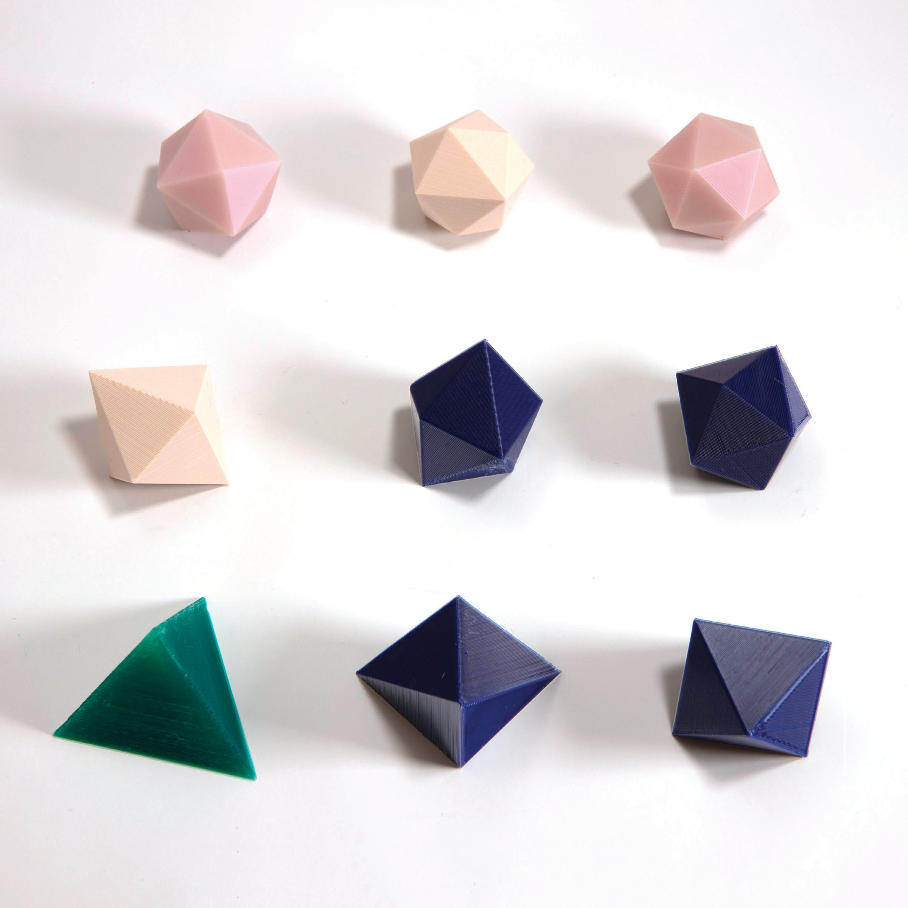

% Alba Marina Málaga Sabogal
% Audition pour le poste de maître de conférences n°4730
% 25 mai 2020

# Études et vie professionnelle

{width=90%}

{width=90%}

# Mes mentors au fil du temps

J'ai travaillé avec:

---------------------- ------------------------------------------------------------- --------------------- ----------
Gilles Courtois         {height=3.5%}          Projet sc. collectif  2009--2010
Vadim Lyubashevsky     {width=3%}       M1 info               2011      
Sylvie Ruette          {width=7.5%} M2 math               2011      
Jean-Christophe Yoccoz {width=7.5%}            Thèse                 2011--2014
Alexander Bufetov      {width=7.5%}     Post-doc              2015      
Richard Schwartz       {width=7.5%}           Post-doc              2019--2020
---------------------- ------------------------------------------------------------- --------------------- ----------

Depuis 2015 j'ai une collaboration suivie avec Serge Troubetzkoy sur la dynamique de surfaces de translation de mesure infinie. 

# Les systèmes dynamiques

- Évolution déterministe à court terme, connue
- Questions concernant l'évolution à long terme

## Exemple: les rotations du cercle

Vue de plusieurs itérations.

{width=100%}

**Thm** (Poincaré) Une rotation du cercle est périodique si et seulement si elle est rationnelle. Sinon, elle est ergodique.

# Exemple: les billards

\centering{width=100%}\par

# Le dépliage des billards

\centering{width=75%}\par

# Surfaces de translation et billards «infinis»

\centering{height=450px}\par

\centering Escalier à recollement variable\par

# Surfaces de translation et billards «infinis»

\centering{height=280px}\par

\centering Escalier à hauteur variable \par

# Surfaces de translation et billards «infinis»

\centering{width=60%}\par

\centering Wind-tree \par

# Ma thèse

J'ai soutenu en 2014 à Orsay une thèse de doctorat intitulée

*Étude d'une famille de transformations\
préservant la mesure de $ℤ × 𝕋$.*

sous la direction de Jean-Christophe Yoccoz (Collège de France).

Résultats sur $ℤ × 𝕋$ $\longleftrightarrow$ escaliers infinis.

**Thm** (2014) Direction fixée, escalier générique: \
dynamique conservative, minimale et ergodique.

# Mes travaux avec Serge Troubetzkoy

Nous poussons beaucoup plus loin les thèmes de ma thèse.

**Thm** (2015) Génériquement, la dynamique du wind-tree est minimale dans un large ensemble de directions.

**Thm** (2016) Génériquement, la dynamique du wind-tree dans presque toute direction est ergodique.

**Thm** (2016) La dynamique d'un billard VH est faiblement mélangeante dans un large ensemble de directions.

**Thm** (2017) Génériquement, la dynamique du wind-tree est d'indice ergodique infini dans un large ensemble de directions.

**Thm** (2019) Génériquement, la dynamique des surfaces en escalier est uniquement ergodique dans un large ensemble de directions.

**Thm** (2019) Génériquement, la dynamique du wind-tree est uniquement ergodique dans un large ensemble de directions.

# Future recherche au sein du LAMA

Équipe: analyse harmonique

On y mélange analyse, probabilités, fractals, et dynamique symbolique.

Collaborations possibles: Mihalache, Liao, ...

Équipe Probabilités et statistiques: Julien Brémont, ...\
Équipe Géométrie et courbure: Benoît Kloeckner

Découvrir: analyse multifractale, applications et interactions avec systèmes dynamiques.

La forte présence du LAMA dans la communauté m'attire:
GDR AMF, écoles à Porquerolles, séminaires SCAM et COOL.

# Cours, cours intégrés, TD

Enseignements déjà dispensés:

* Équations différentielles
* Mathématiques numériques avec Python
* Calculus
* Analyse
* Calcul formel avec SageMath
* Structures algébriques
* Gestion de contenu avec Wordpress
* Algèbre linéaire
* Calcul vectoriel
* Calcul intégral
* Programmation orientée objet avec Java
* Introduction à l’informatique avec C++

# Cours de mathématiques à la FSEG à Créteil

Bases mathématiques de modélisation économique et de gestion,\
en licence. Dans les maquettes actuelles:

|Année           |Intitulé du cours                        |
|----------------|-----------------------------------------|
|Parcours amenagé|Mathématiques                            |
|                |Statistiques descriptives I              |
|L1              |Mathématiques                            |
|                |Statistiques et outils informatiques I   |
|Passerelle      |Outils mathématiques                     |
|                |Statistiques  descriptives  sur  Excel   |
|L2              |Mathématiques                            |
|                |**Probabilités, estimation et tests**    |
|L3              |**Mathématiques des systèmes dynamiques**|
|                |Processus stochastiques en finance       |
|                |Optimisation dynamique                   |

Master: science des données, apprentissage automatique, ...

# Quelques idées de projets avec des étudiants en économie

- Recensements de population universels vs randomisés
- Résultats Pisa et politiques éducatives des pays de l'OCDE
- Répartition des revenus: outils d'analyse,\
  vision synchronique et diachronique
- Les systèmes d'imposition et leur évolution
- Croissance économique: vision à court terme et long terme
- Le coût de la santé
- Le financement des retraites

# Médiation et diffusion scientifique

\centering  \par

\centering $\sim$ 30 expositions, forums, salons, exposés, ... \par

# Médiation et diffusion scientifique

\centering  \par

\centering Objets mathématiques \par

# Médiation et diffusion scientifique

\centering {width=60%}\par

\centering Polyèdres d'Akiyama \par

# Pour finir...

|                                                   |                                                |                                                        |
|-------------------------------------------|----------------------------------------|-----------------------------------------|
|continuité et ouverture dans la recherche|un vrai souci de l'accessibilité  |fibre «maker»|
|intérêt en médiation scientifique|enseignement dans le respect|parcours polyvalent|

J'ai à cœur de m'intégrer dans la recherche au LAMA et dans l'enseignement à la FSEG.

{width=100%}
