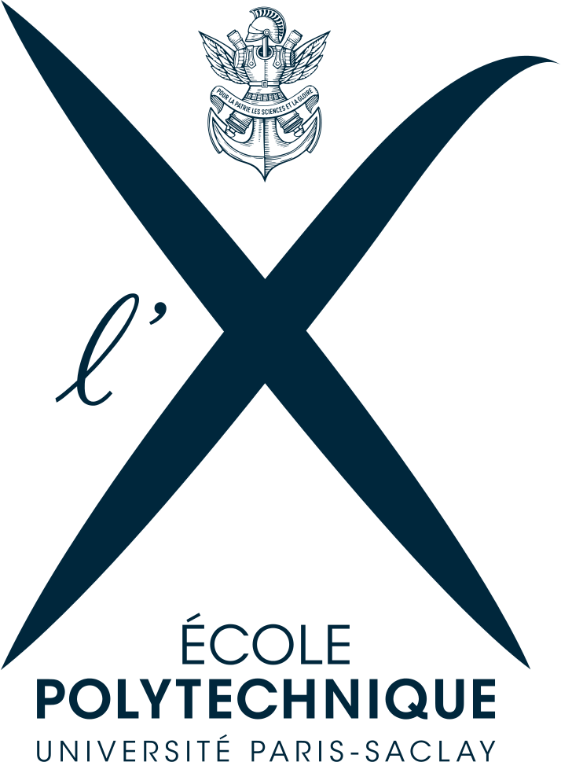
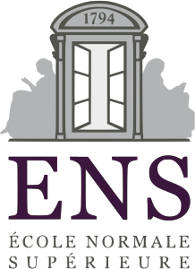
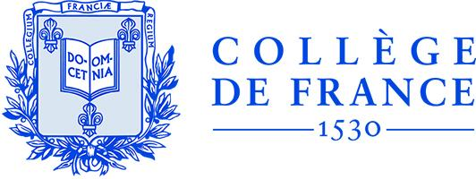
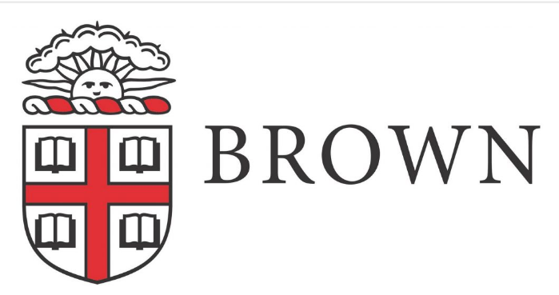
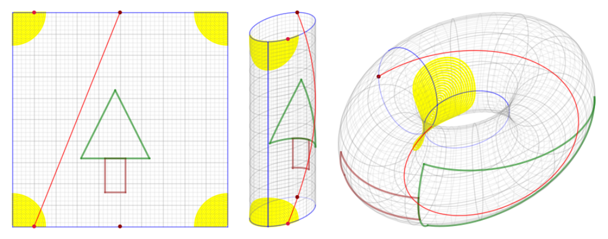
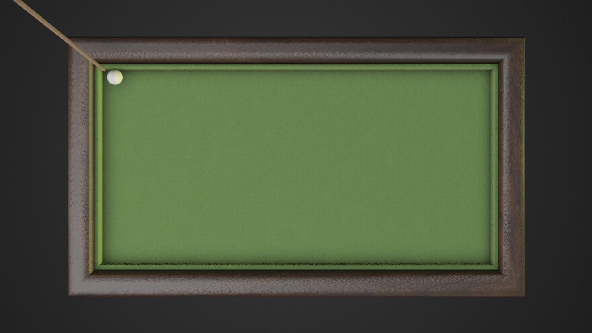
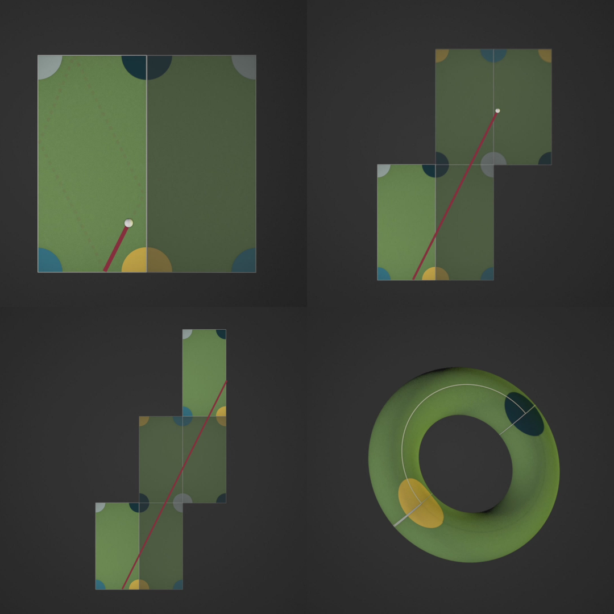
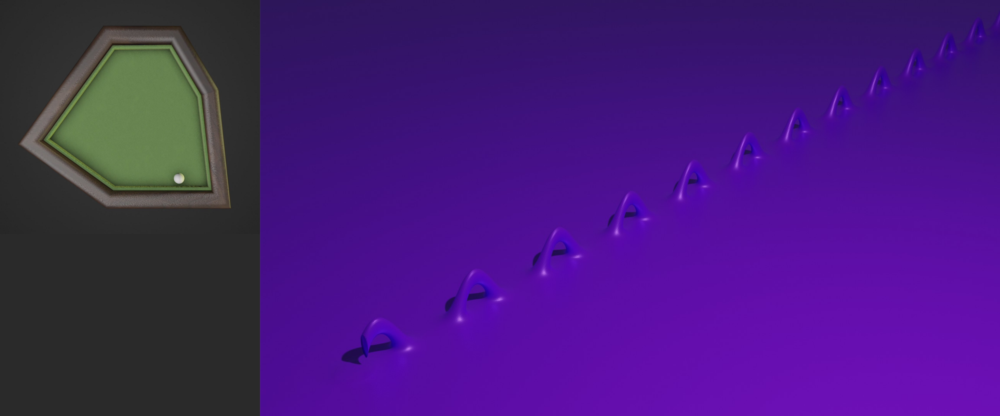
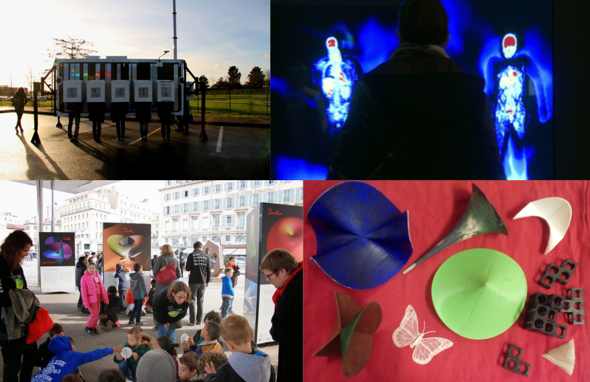

% Alba Marina Málaga Sabogal
% Audition pour le poste de maître de conférences n°4730
% 25 mai 2020

# Études et vie professionnelle

{width=90%}

{width=90%}

# Mes mentors au fil du temps

J'ai travaillé avec:

---------------------- ------------------------------------------------------------- --------------------- ----------
Gilles Courtois         {height=3.5%}          Projet sc. collectif  2009--2010
Vadim Lyubashevsky     {width=3%}       M1 info               2011      
Sylvie Ruette          {width=7.5%} M2 math               2011      
Jean-Christophe Yoccoz {width=7.5%}            Thèse                 2011--2014
Alexander Bufetov      {width=7.5%}     Post-doc              2015      
Richard Schwartz       {width=7.5%}           Post-doc              2019--2020
---------------------- ------------------------------------------------------------- --------------------- ----------

Depuis 2015 j'ai une collaboration suivie avec Serge Troubetzkoy sur la dynamique de surfaces de translation de mesure infinie. 

# Les systèmes dynamiques

- Évolution déterministe à court terme, connue
- Questions concernant l'évolution à long terme

## Exemple: les rotations du cercle

Vue de plusieurs itérations.

{width=100%}

**Thm** (Poincaré) Une rotation du cercle est périodique si et seulement si elle est rationnelle. Sinon, elle est ergodique.

# Exemple: le flot linéaire sur un tore plat

\vfill

{width=100%}

# Exemple: les billards

{width=100%}

[Extrait](movies/ball-rolling-on-a-billiard-table-hale.mov) du film «Secrets of the Surface» de Csicsery, comme les autres images et animations de Andrea Hale à suivre.

# Le dépliage des billards

{width=75%}

# Exemple: la surface en L

, par MS](img/snake-L-1.png){width=60%}

# Surfaces de translation et billards «infinis»

Le dépliage d'un billard irrationnel est une surface de genre infini.

{width=100%}

# Surfaces de translation et billards «infinis»

{height=450px}

# Surfaces de translation et billards «infinis»

{height=280px}

# Surfaces de translation et billards «infinis»

](img/wind-tree.png){width=60%}

# Ma thèse sous la direction de J.-C. Yoccoz

J'ai soutenu en 2014 à Orsay une thèse de doctorat intitulée

*Étude d'une famille de transformations\
préservant la mesure de $ℤ × 𝕋$.*

sous la direction de Jean-Christophe Yoccoz (Collège de France).

Mes résultats sur $ℤ × 𝕋$ peuvent s'exprimer en termes de dynamique des escaliers infinis.

**Thm** (2014) Si l'on fixe une direction dans le plan alors la dynamique d'un escalier générique dans cette direction est conservative, minimale et ergodique.

# Mes travaux avec Serge Troubetzkoy

Nous poussons beaucoup plus loin les thèmes de ma thèse.

**Thm** (2015) Génériquement, la dynamique du wind-tree est minimale dans un large ensemble de directions.

**Thm** (2016) Génériquement, la dynamique du wind-tree dans presque toute direction est ergodique.

**Thm** (2016) La dynamique d'un billard VH est faiblement mélangeante dans un large ensemble de directions.

**Thm** (2017) Génériquement, la dynamique du wind-tree est d'indice ergodique infini dans un large ensemble de directions.

**Thm** (2019) Génériquement, la dynamique des surfaces en escalier est uniquement ergodique dans un large ensemble de directions.

**Thm** (2019) Génériquement, la dynamique du wind-tree est uniquement ergodique dans un large ensemble de directions.

# Cinq articles avec Serge Troubetzkoy (Marseille)

[Disponibles sur HAL](https://hal.archives-ouvertes.fr/search/index/?q=*&authFullName_s=Alba+Málaga+Sabogal)

Minimality of the Ehrenfest wind-tree model\
*Journal of modern dynamics* 10 (2016), 209–228

Ergodicity of the Ehrenfest wind–tree model\
*Comptes rendus mathématique* 354:10 (2016), 1032–1036

Weakly mixing polygonal billiards\
*Bull. London Math. Soc.* 49 (2017), 141–147

Infinite ergodic index of the Ehrenfest wind-tree model\
*Commun. Math. Phys.* 358 (2018), 995–1006

Unique ergodicity of infinite area translation surfaces\
Soumis (2019), 25 p.

**Autre collaboration:** Plongements polyédraux de tores plats,\
avec Pierre Arnoux (Marseille) et Samuel Lelièvre (Orsay). 

# Quelques exposés récents 

## Exposés de seminaire

  - [*Brown University Geometry/Topology*](https://www.math.brown.edu/~res/seminar.html),
    Providence, 2020

  - [*Complex Analysis and Dynamics*](https://qcpages.qc.cuny.edu/~zakeri/seminar.html),
    New York, 2020

  - [*Tufts Math Dynamics and Probability*
    Seminar](https://sites.tufts.edu/dynsyssem/), Medford, 2019

  - [IM ICERM *Special Interest*
    Seminar](https://icerm.brown.edu/programs/sp-f19/),
    Providence, 2019

  - [*Applied Math*
    Seminar](http://www.math.auckland.ac.nz/Directory/jahia/seminar/?item=2295),
    Auckland, 2018
    
## Exposés à des colloques

  - [*Outils logiciels pour les mathématiques et
    l’illustration*](https://wiki.sagemath.org/days107), 2020

  - [*IX Congreso Internacional sobre enseñanza de las
    Matemáticas*](http://indico.pucp.edu.pe/event/3/overview),
    Huancavelica, 2018

  - [*Dynamique en mesure
    infinie*](https://www.lebesgue.fr/fr/content/sem2017-Infinite-Dyn),
    Brest, 2017

# Future recherche au sein du LAMA

Équipe: analyse harmonique

On y mélange analyse, probabilités, fractals, et dynamique symbolique.

Collaborations possibles: Mihalache, Liao, ...

Équipe Probabilités: Julien Bremont, ...\
Équipe Géométrie et Courbure: Bénoît Kloeckner

Découvrir: analyse multifractale, applications et interactions avec systèmes dynamiques.

La forte présence du LAMA dans la communauté m'attire:
GDR AMF, écoles à Porquerolles, séminaires SCAM et COOL.

# Expérience d'enseignement 

|         |Lieu             |         |Quelques cours|
|--------:|:----------------|:--------|:--------------------|
|2018-2019|Paris-Saclay, 60h|info     |{width=7.5%}|
|2016-2017|Paris 8, 192h    |info     |{width=7.5%}|
|         |                 |L2 MIASHS| Math. numériques|
|2015-2016|Paris-Sud, 192h  |math     |{width=7.5%}|
|         |                 |L3 BS, C | Équa. diff.|
|         |                 |L1 MPI   | Algèbre linéaire|
|         |                 |PCSO     | Géométrie, Analyse|
|2014     |Paris-Sud, 96h   |math     |{width=7.5%}|
|         |                 |L2 BC    | Équa. diff.|
|2008     |UNI Lima, 192h   |math     |{width=7.5%}|
|         |                 |L2 M     | Algèbre linéaire|
|         |                 |L1 MPC   | Calcul vectoriel|

**>600h** dont 192h responsable de cours

# Cours, cours intégrés, TD

Enseignements déjà dispensés:

* Équations différentielles
* Mathématiques numériques avec Python
* Calculus
* Analyse
* Calcul formel avec SageMath
* Structures algébriques
* Gestion de contenu avec Wordpress
* Algèbre linéaire
* Calcul vectoriel
* Calcul intégral
* Programmation orientée objet avec Java
* Introduction à l’informatique avec C++

# Facultés d'adaptation

* Programme du lycée très différent du mien

    * j'ai étudié les programmes (EduScol)

* Cours de maths numériques sans ordinateurs

    - Python sur smartphone (console Android)

* Étudiants d'origines diverses

    - je peux enseigner en français, anglais, espagnol, polonais

* Souci d'accessibilité

    - supports accessibles pour étudiants aveugles

# Cours de mathématiques à la FSEG à Créteil

Bases mathématiques de modélisation économique et de gestion,\
en licence. Dans les maquettes actuelles:

|Année           |Intitulé du cours                        |
|----------------|-----------------------------------------|
|Parcours amenagé|Mathématiques                            |
|                |Statistiques descriptives I              |
|L1              |Mathématiques                            |
|                |Statistiques et outils informatiques I   |
|Passerelle      |Outils mathématiques                     |
|                |Statistiques  descriptives  sur  Excel   |
|L2              |Mathématiques                            |
|                |**Probabilités, estimation et tests**    |
|L3              |**Mathématiques des systèmes dynamiques**|
|                |Processus stochastiques en finance       |
|                |Optimisation dynamique                   |

Master: science des données, apprentissage automatique, ...

# Future adaptation à la FSEG à Créteil

* je connais Python et R
* j'ai enseigné les équations différentielles dans divers parcours
* j'ai fait de l'apprentissage machine
* je suis prête à apprendre SAS, EViews, Stata
* intérêt personnel pour l'économie\
  lectures: Jean Tirole, Esther Duflo, Joseph Stiglitz, ...
* apprendre tout au long de la vie, c'est ma devise 
* idées de projets avec des étudiants en économie

# Quelques idées de projets avec des étudiants en économie

- Recensements de population universels vs randomisés
- Résultats Pisa et politiques éducatives des pays de l'OCDE
- Répartition des revenus: outils d'analyse,\
  vision synchronique et diachronique
- Les systèmes d'imposition et leur évolution
- Croissance économique: vision à court terme et long terme
- Le coût de la santé
- Le financement des retraites

# Activités de médiation scientifique

{width=90%}

$\sim$ 30 expositions, forums, salons, exposés, ...

# Pour finir...

|                                                   |                                                |                                                        |
|-------------------------------------------|----------------------------------------|-----------------------------------------|
|parcours polyvalent          |un vrai souci de l'accessibilité  |fibre «maker»|
|intérêt en médiation scientifique|enseignement dans le respect|continuité dans la recherche|

J'ai à cline.png){width=100%}
 e au LAMA et dans l'enseignement à la FSEG.

![](img/alégrer dans la recherchœur de m'inba-time